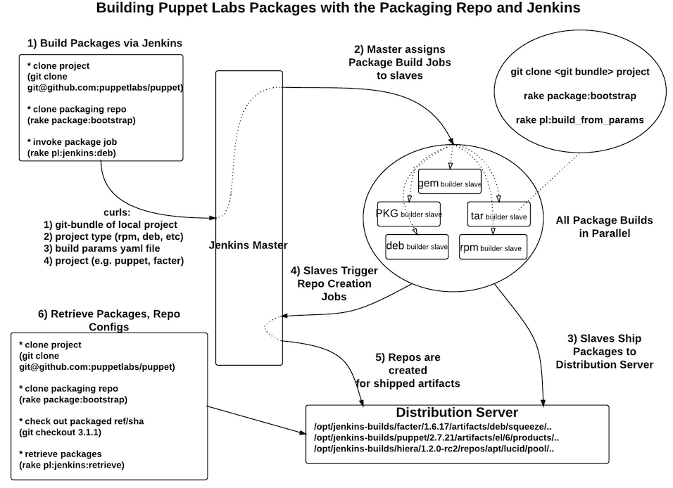

!SLIDE bullets incremental small
## How it works, or
# I want to build a package!
(we've got some work to do)

##....git clone packaging repo...  
##....create git-bundle of local repo...  
##....write build parameters file...  
##....determine build type (deb? rpm?)...  
##....determine project (is it puppet?)...  
##....send it all to jenkins...done!  

!SLIDE bullets incremental small
# But how did I do that??

## (two rake comands)  
## setup (`rake package:bootstrap`)  
## and package (`rake pl:jenkins:uber_build`)  

After a hard day's work, note the Jenkins job url and go get a beer. Easy right?

!SLIDE bullets
# Meanwhile, on Jenkins... #

* * NodeLabelParameter plugin picks the right builder slave for the job
* * Slave clones project bundle and packaging repo
* * Slave executes the build using build data params file (`rake pl:build_from_params`)
* * Artifacts are off to distribution server!

!SLIDE center

!SLIDE bullets
# Wait, this is awesome why? #

* * Jenkins job completely abstracted from project and target platform
* * Add new projects with zero jenkins-side maintenance (no project-specific logic in the job)
* * Scale by just adding more builders as labeled Jenkins slaves, no reconfiguration
* * Commit does not need to be checked into upstream (do your worst)
